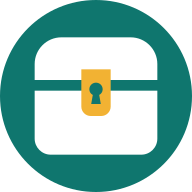

<p align="center">
  
</p>

<h1 align="center">Scrigno</h1>

<p align="center">
  <b>Le tue foto. Sul tuo server.</b> · <i>Your photos. On your server.</i><br>
  Backup di foto e video Android sul <b>tuo</b> server (SFTP, FTP/FTPS, SMB/Samba, WebDAV), anonimo e open source.
</p>

<p align="center">
  <a href="#italiano">🇮🇹 Italiano</a> · <a href="#english">🇬🇧 English</a>
</p>

---

<a id="italiano"></a>

## 🇮🇹 Italiano

### Cos'è

**Scrigno** è un'app Android che salva le foto e i video del telefono su un server che è **tuo**: un NAS
(Synology, QNAP, TrueNAS…), un computer di casa, un Raspberry Pi o un server in affitto. È un'alternativa a
Google Foto e iCloud Foto che funziona come loro — backup automatico, "libera spazio", galleria con tutte le foto —
ma i file restano solo a casa tua.

### Funzioni

- **Protocolli**: SFTP (consigliato), FTPS, FTP, SMB 2/3 (cartelle condivise Windows, Samba, NAS), WebDAV su
  HTTPS o HTTP (Nextcloud, ownCloud, Synology, Apache, nginx…).
- **Server raggiungibile con indirizzo IP o nome (FQDN)**, utente e password. Puoi anche incollare un URL completo,
  per esempio `sftp://nas.local:2222/srv/foto` o `https://cloud.example.com/remote.php/dav/files/mario`.
- **Backup automatico, senza aprire l'app**: le foto e i video nuovi vanno sul server da soli **poco dopo lo
  scatto**, come con Google Foto. In più c'è un backup completo ogni 6/12 ore, ogni giorno, ogni 3 giorni o ogni
  settimana, all'orario che scegli (di notte per impostazione predefinita), solo con Wi‑Fi e/o solo in carica.
  Oppure "Esegui backup ora".
- **Scelta delle cartelle** da salvare (Fotocamera, WhatsApp, Screenshot…), foto e, se vuoi, video.
- **Libera spazio**: le foto già al sicuro sul server e più vecchie di N giorni (7, 30, 90, 365… o subito)
  vengono rimosse dal telefono **solo dopo aver verificato** che sul server il file sia completo. Nella galleria
  resta un'anteprima leggera: quando apri la foto viene scaricata dal server, come su iPhone con
  "Ottimizza spazio".
- **Galleria unica** stile "Foto", divisa per mesi, con zoom, video, condivisione, dettagli e filtri
  (tutte / sul telefono / solo sul server / non ancora salvate).
- **Riporta sul telefono** una foto che è solo sul server, oppure eliminala dal server.
- **Ricostruisci l'elenco dal server** dopo aver reinstallato l'app: ritrovi tutte le foto di questo telefono.
- **Upload sicuro**: nome temporaneo durante il trasferimento, poi rinomina e verifica della dimensione;
  un file con lo stesso nome non viene mai sovrascritto; un backup interrotto riprende da dove si era fermato.
- **Sicurezza delle connessioni**: la chiave SSH del server e i certificati TLS autofirmati vengono memorizzati
  al primo collegamento ("trust on first use") e ogni cambiamento successivo viene bloccato.
- **Italiano e inglese** (segue la lingua del telefono), tema chiaro/scuro, colori Material You.

### Privacy: anonima davvero

- Nessun account, nessuna pubblicità, nessuna statistica, nessun rapporto di crash, nessun servizio Google.
- L'app si collega **solo** al server che configuri tu.
- Impostazioni ed elenco dei backup restano sul telefono; la password è cifrata con il **Keystore di Android**.
- I dati dell'app sono **esclusi** dal backup su cloud di Android e dal trasferimento su un nuovo telefono.
- Le foto mantengono la posizione GPS originale (permesso "posizione dei contenuti multimediali").

---

### 📲 Installazione sul telefono

Serve Android **8.0 o successivo**. Il file da installare si chiama **`Scrigno.apk`** e si trova nella pagina
**Releases** del repository (la release `nightly` contiene sempre l'ultima versione compilata dalla CI).

#### Metodo 1 — dal browser (il più semplice)

1. Sul telefono apri la pagina **Releases** del repository su GitHub
   (`https://github.com/BitJacker/iniziare/releases`) e tocca **`Scrigno.apk`** per scaricarlo.
2. Apri il file scaricato (dalla notifica del download o dall'app *File* → *Download*).
3. Android chiede di **consentire l'installazione di app sconosciute** per il browser (o per l'app File):
   tocca *Impostazioni*, attiva *Consenti da questa fonte*, torna indietro.
4. Tocca **Installa**. Se compare Play Protect, scegli *Installa comunque* (l'app non è sul Play Store, è normale).
5. Tocca **Apri**, oppure cerca l'icona **Scrigno** (uno scrigno bianco con la serratura dorata) tra le app.

> Il repository è privato? Per scaricare dal browser devi aver fatto l'accesso a GitHub con l'account che vi
> ha accesso. Per un download senza account rendi pubblico il repository
> (*Settings → General → Danger zone → Change visibility*).

#### Metodo 2 — da Termux

[Termux](https://termux.dev) è un terminale per Android (installalo da F-Droid o GitHub). Lo script
[`scripts/termux-install.sh`](scripts/termux-install.sh) scarica l'ultima versione, **verifica il checksum
SHA-256** e apre l'installatore di Android.

Repository **pubblico**:

```sh
pkg update && pkg install -y curl
curl -fsSL https://raw.githubusercontent.com/BitJacker/iniziare/HEAD/scripts/termux-install.sh | bash
```

Repository **privato** (accesso una sola volta con la GitHub CLI):

```sh
pkg update && pkg install -y gh
gh auth login
gh api -H "Accept: application/vnd.github.raw" repos/BitJacker/iniziare/contents/scripts/termux-install.sh | bash
```

Poi: se Android lo chiede, **consenti a Termux di installare app sconosciute**, tocca **Installa** e **Apri**.
Opzioni utili (variabili d'ambiente): `SCRIGNO_TAG=nightly` (o una versione, es. `v0.1.0`),
`GITHUB_TOKEN=...` (repository privato senza `gh`), `SCRIGNO_URL=https://tuo-server/cartella` (per installare da
una copia sul tuo server). Se prima esegui `termux-setup-storage`, l'APK viene copiato anche nella cartella
*Download*.

Per **aggiornare** l'app basta ripetere lo stesso comando (o scaricare il nuovo `Scrigno.apk`): i dati restano.

#### Metodo 3 — da un computer (adb)

Con il *Debug USB* attivo: `adb install -r Scrigno.apk`.

---

### ▶️ Primo avvio

1. **Benvenuto** → tocca **Inizia**.
2. **Accesso alle foto** → **Consenti l'accesso** e scegli *Consenti tutto* (se concedi solo alcune foto, le
   altre non verranno salvate). Consenti anche le **notifiche**: mostrano l'avanzamento del backup. Poi **Continua**.
3. **Il tuo server** → scegli il protocollo e compila:
   - **Indirizzo del server**: IP (`192.168.1.10`) o nome (`nas.miodominio.it`), oppure un URL completo;
   - **Porta** (si compila da sola: 22 SFTP, 21 FTP/FTPS, 445 SMB, 443/80 WebDAV);
   - **Nome utente** e **password**;
   - per SMB il **nome della condivisione**;
   - **Cartella sul server** dove salvare (viene creata se non c'è).
4. Tocca **Prova connessione**: Scrigno accede, crea la cartella e scrive un file di prova. Alla prima connessione
   SFTP/TLS mostra l'**impronta del server**: se vuoi essere sicuro confrontala con quella del tuo server
   (per SSH: `ssh-keygen -lf /etc/ssh/ssh_host_ed25519_key.pub`). Poi **Salva**.
5. Nella scheda **Backup** tocca **Esegui backup ora** per il primo backup. Da quel momento fa tutto da solo,
   anche con l'app chiusa: ogni foto nuova va sul server poco dopo lo scatto, e ogni notte alle 02:00 c'è un
   backup completo (di default solo con Wi‑Fi).
6. Per **liberare spazio**: in *Backup* → *Tieni sul telefono* scegli per esempio *Gli ultimi 30 giorni*, poi
   **Libera spazio**. Android chiede conferma con la sua finestra di sistema. Le foto rimosse restano nella galleria
   con l'icona ☁️ e si scaricano quando le apri.

Le foto finiscono sul server così: `<cartella>/<nome del telefono>/<anno>/<mese>/IMG_1234.jpg`
(il nome del telefono si cambia in *Impostazioni*, utile se fai il backup di più telefoni).

### 🖥️ Esempi di server

| Server | Protocollo in Scrigno | Cosa inserire |
|---|---|---|
| Linux / Raspberry Pi con SSH | SFTP | IP, porta 22, utente e password Linux, cartella es. `/srv/foto` |
| Synology / QNAP / TrueNAS | SFTP (attiva SSH/SFTP) o SMB | IP del NAS; per SMB la condivisione, es. `photo` |
| Windows (cartella condivisa) | SMB | IP del PC, nome condivisione, utente e password di Windows |
| Nextcloud | WebDAV (HTTPS) | `cloud.esempio.it`, cartella `/remote.php/dav/files/UTENTE/Foto`, meglio una *password per app* |
| Server FTP (vsftpd, ProFTPD, FileZilla) | FTPS (o FTP solo in LAN) | IP, porta 21, utente e password |

Server SFTP di prova in un minuto con Docker:

```sh
docker run -d --name scrigno-sftp -p 2222:22 -v /srv/foto:/home/foto/upload atmoz/sftp foto:unaPasswordLunga:1001
# In Scrigno: SFTP, porta 2222, utente "foto", cartella "upload"
```

Samba, esempio di condivisione in `/etc/samba/smb.conf` (poi `sudo smbpasswd -a mario`):

```ini
[foto]
   path = /srv/foto
   valid users = mario
   read only = no
```

Suggerimenti: da fuori casa usa SFTP/FTPS/WebDAV su HTTPS oppure una VPN (WireGuard, Tailscale): FTP, WebDAV
su HTTP e SMB **non** sono cifrati. Per FTPS con vsftpd imposta `require_ssl_reuse=NO`.

### ❓ Problemi comuni

- **"Server non trovato"**: controlla l'indirizzo; i nomi `.local` funzionano solo se la rete li supporta.
- **"Nome utente o password errati"**: prova le stesse credenziali da un computer; per SMB prova a indicare il dominio
  o il gruppo di lavoro.
- **Il backup automatico non parte**: il momento esatto lo decide Android, che rimanda i lavori in background
  quando la batteria è scarica o l'app non si usa da tempo (di solito le foto nuove partono entro pochi minuti,
  se sei sul Wi‑Fi). Lascia il telefono in carica e sul Wi‑Fi di notte, e togli Scrigno dall'ottimizzazione
  batteria se il produttore è aggressivo (Xiaomi, Huawei, Samsung…).
- **"L'identità del server è cambiata"**: se hai reinstallato il server, apri *Il tuo server* e tocca
  *Dimenticala*; altrimenti **non** procedere.

### 🛠️ Compilare dal codice

Servono JDK 17 e Android SDK (API 35).

```sh
./gradlew :app:assembleDebug        # APK di sviluppo in app/build/outputs/apk/debug/
./gradlew :app:assembleRelease      # APK ottimizzato in app/build/outputs/apk/release/
```

Il repository contiene una chiave di firma **pubblica di sviluppo** (`app/debug.keystore`), così ogni build della CI
si installa sopra la precedente. Per distribuire l'app con la **tua** chiave crea un keystore e aggiungi ai *Secrets*
del repository `SCRIGNO_KEYSTORE_BASE64` (il file in base64), `SCRIGNO_KEYSTORE_PASSWORD`, `SCRIGNO_KEY_ALIAS`,
`SCRIGNO_KEY_PASSWORD`. Un tag `v*` (es. `git tag v0.1.0 && git push --tags`) pubblica una release versionata.

Struttura: `core/` (Kotlin puro: protocolli, upload verificato, logica) e `app/` (Android, Jetpack Compose).
I testi dell'interfaccia si modificano in [`scripts/generate_strings.py`](scripts/generate_strings.py).

### ✅ Test

- `./gradlew :core:test` — i client FTP, SFTP e WebDAV vengono provati contro **server veri avviati nei test**
  (Apache FtpServer, Apache MINA SSHD, un server WebDAV in memoria): upload, verifica, deduplica, collisioni di nomi,
  rinomina, cancellazione, password errata, impronta del server cambiata.
- `./gradlew :core:test --tests '*ExternalServerTest' -Dscrigno.it.protocol=SMB -Dscrigno.it.host=… -Dscrigno.it.share=… -Dscrigno.it.user=… -Dscrigno.it.password=…`
  — gli stessi test contro un tuo server qualsiasi (anche SMB, FTPS, WebDAVS).
- `./gradlew :app:testDebugUnitTest` — logica dell'app (filtri, galleria, pianificazione).
- `./gradlew :app:connectedDebugAndroidTest` — test sul telefono/emulatore: database, cifratura della password,
  backup completo end-to-end verso un server con ogni protocollo, "libera spazio", interfaccia, e il **backup
  automatico**: una foto nuova arriva sul server da sola, senza aprire l'app.

La CI (GitHub Actions) esegue tutto a ogni push, compila gli APK e li pubblica nella release `nightly`.

### Licenza

[GNU GPL v3.0 o successiva](LICENSE). Scrigno è software libero e viene fornito senza alcuna garanzia.

---

<a id="english"></a>

## 🇬🇧 English

### What it is

**Scrigno** (Italian for *treasure chest*) is an Android app that backs up the photos and videos of your phone to a
server **you own** — a NAS, a home computer, a Raspberry Pi, a rented server — instead of Google Photos or iCloud.
It works like them (automatic backup, "free up space", one gallery with every photo) but your files never leave
your hands.

### Features

- **Protocols**: SFTP (recommended), FTPS, FTP, SMB 2/3 (Windows shares, Samba, NAS), WebDAV over HTTPS or HTTP
  (Nextcloud, ownCloud, Synology, Apache, nginx…).
- **Server by IP address or FQDN**, user name and password; full URLs can be pasted too.
- **Automatic backup, without opening the app**: new photos and videos go to the server by themselves **shortly
  after you take them**, like with Google Photos, plus a full backup every 6/12 hours, daily, every 3 days or
  weekly, at the time you choose, Wi‑Fi only and/or while charging. Or tap "Back up now".
- **Folders** to back up, photos and optionally videos.
- **Free up space**: backed up photos older than N days are removed from the phone **only after checking** the
  copy on the server. A light preview stays in the gallery and the original is downloaded when you open it.
- **One gallery** grouped by month, with zoom, videos, sharing, details and filters; bring photos back to the
  phone or delete them from the server; rebuild the list from the server after reinstalling.
- **Safe uploads** (temporary name, rename, size check, never overwrites, resumes after interruptions) and
  **trust on first use** pinning of SSH host keys and self-signed TLS certificates.
- **English and Italian**, light/dark theme, Material You.

### Privacy

No account, no ads, no analytics, no crash reporting, no Google services. The app only connects to your server.
Settings and the backup index stay on the phone, the password is encrypted with the Android Keystore, and app data
is excluded from Android cloud backups and device-to-device transfers.

### 📲 Install on your phone

Android **8.0+**. Download **`Scrigno.apk`** from the repository **Releases** page (the `nightly` release always
holds the latest CI build).

1. **Browser**: open `https://github.com/BitJacker/iniziare/releases` on the phone, tap `Scrigno.apk`, open the
   download, allow *install unknown apps* for the browser when asked, tap **Install**, then **Open**.
2. **Termux** (public repository):
   ```sh
   pkg update && pkg install -y curl
   curl -fsSL https://raw.githubusercontent.com/BitJacker/iniziare/HEAD/scripts/termux-install.sh | bash
   ```
   Private repository: `pkg install -y gh && gh auth login`, then
   `gh api -H "Accept: application/vnd.github.raw" repos/BitJacker/iniziare/contents/scripts/termux-install.sh | bash`.
   The script verifies the SHA-256 checksum and opens the Android installer (allow Termux to install unknown apps).
   Run it again to update.
3. **Computer**: `adb install -r Scrigno.apk`.

### ▶️ First launch

1. **Get started** → **Allow access** to photos (choose *Allow all*) and notifications → **Continue**.
2. **Your server**: pick the protocol, type the IP address or name, port, user name, password, share (SMB) and
   folder → **Test connection** (Scrigno logs in, creates the folder and writes a test file; on the first SFTP/TLS
   connection it shows the server fingerprint) → **Save**.
3. **Backup** tab → **Back up now**. From then on it runs by itself, even with the app closed: every new photo
   goes to the server shortly after you take it, plus a full backup every night at 02:00 (default: Wi‑Fi only).
4. To **free up space** choose *Keep on the phone* (e.g. *The last 30 days*) and tap **Free up space**; Android
   asks for confirmation. Removed photos stay in the gallery with a ☁️ badge.

Files are stored as `<folder>/<phone name>/<year>/<month>/<file>`.

### 🛠️ Build and test

```sh
./gradlew :core:test :app:testDebugUnitTest      # unit tests, protocols against embedded servers
./gradlew :app:connectedDebugAndroidTest         # on a device/emulator: automatic and end-to-end backup, free up space, UI
./gradlew :app:assembleRelease                   # APK
```

Release signing with your own key: add the `SCRIGNO_KEYSTORE_BASE64`, `SCRIGNO_KEYSTORE_PASSWORD`,
`SCRIGNO_KEY_ALIAS` and `SCRIGNO_KEY_PASSWORD` repository secrets. Push a `v*` tag for a versioned release.

### License

[GNU GPL v3.0 or later](LICENSE). Scrigno is free software and comes with ABSOLUTELY NO WARRANTY.
